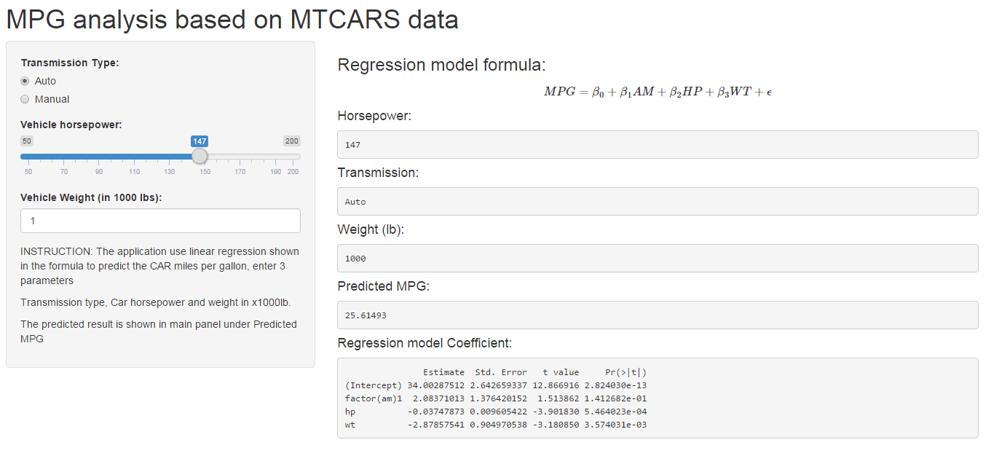

Data Product: MPG predictor with linear regression using MTCARS
========================================================
author: @xhoong
date: 25 Dec 2015

Overview
========================================================

The shiny app is to predict cars miles per gallon using model develop from 
Regression Model course that is part of Data Scient Specialization.

The regression model will predict MPG based on
- Transmission type (Auto/Manual)
- Weight in 1000 lb
- Horsepower of the engine

Shiny App links
========================================================

The Shiny App is running from RStudio shinyapps.io site and below is the
link:

- [DataProd Shiny App](http://xhoong.shinyapps.io/DataProd)

Where you will find 2 panels, the panel on the left is for input on the 3 predictors
and results is shown in the right panel

Regression model for predicting MPG
========================================================

Linear regression model:
$$MPG = \beta_0 + \beta_{1}AM + \beta_{2}HP + \beta_{3}WT + \epsilon$$

Coefficient for the $\beta_0, \beta_1, \beta_2 and \beta_3$


```r
require(knitr)
source("mtcars.R")
kable(summary(bestfit)$coef)
```


|            |   Estimate| Std. Error|   t value| Pr(>&#124;t&#124;)|
|:-----------|----------:|----------:|---------:|------------------:|
|(Intercept) | 34.0028751|  2.6426593| 12.866916|          0.0000000|
|factor(am)1 |  2.0837101|  1.3764202|  1.513862|          0.1412682|
|hp          | -0.0374787|  0.0096054| -3.901830|          0.0005464|
|wt          | -2.8785754|  0.9049705| -3.180850|          0.0035740|

Shiny App screen shot
========================================================


